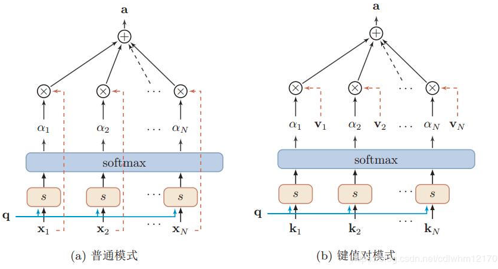
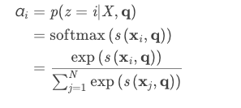
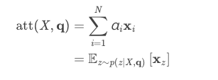
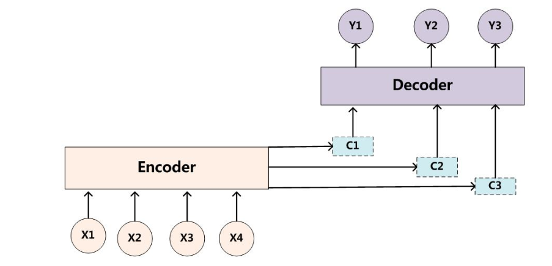

# AS-LSTM
## 项目介绍

毕设题目：

基于表情符号和新词识别的情感分析

[metas](https://github.com/CstomRita/metas)是以此算法为底层设计的可视化系统

## pytorch 注意力机制

### **前提**

1. 输入向量一个长度为N的一维数组 [x1,x2,x3...xn]
2. 一个额外和任务有关的变量(查询向量) q

### 分类

1. 软注意力机制

   

   注意力分布αi为在给定任务相关的查询q时，第i个输入向量受注意的程度。

   公式是注意力机制中给定的：

   1. 
   2. 

### 实现

根据业务场景，选择软注意力机制，我们要探究的是在表情符作用下，某个词的重要程度。

1. input[x1,x2,x3...xn] 经过embed，并经过LSTM

```python
embedded = self.embedding(input).view(1, 1, -1)
lstm_out = self.lstm(embedded)
```

2. 获取输入embedding和查询向量q的相似度,让全连接层自己来学习,把输入和查询向量连接在一起经过线性层

   ```python
   self.attn = nn.Linear(self.hidden_size*2, 1)
   similarity=self.attn(torch.cat((embedded, q), 1))
   ```

```python
for i in range(n):
	
```


3. 经过softmax得到权重矩阵即α矩阵

   ```pyrhon
   attn_weights = F.softmax(similarity, dim=1)
   ```

4. 权重矩阵作用在输入经过lstm的输出向量上，获得attention结果  (bmm：*对应相乘再相加*)，得到上图显示的最终a向量

   ```python
   attn_applied = torch.bmm(attn_weights.unsqueeze(0),lstm_out.unsqueeze(0))
   ```

> 平时搜到的代码都是关于机器学习的
>
> 
>
> 但是这个代码是比我当前应用场景复杂的
>
> 它改变的是C，再用C 和 输入 cat做运算
>
> 当前我的业务场景和上图Attention机制是一样的，根据Q得到权重矩阵，并乘积相加即可

## 项目结构

### train_01

去除表情符后，利用传统lstm，获取文本语义--->分类

数据集格式：tensor.sentence_no_emoji：分词后的一维数组

### train_02_textemoji

文本 + 表情符号 拼接后一起加入LSTM中

数据集格式：

1. tensor.sentence_no_emoji：分词后的一维数组
2. tensor.emoji：各个分句的表情符号，二维数组----->在train.py中reshape成一维数组，再传入模型

模型训练：

模型入参：sentences：一维数组；all_emojis：一维数组

### train_03_emojiorigin_origin

传统表情符注意力机制

数据集格式：

1. tensor.sentence_no_emoji：分词后的一维数组
2. tensor.emoji：各个分句的表情符号，二维数组----->在train.py中reshape成一维数组，再传入模型

模型训练：

模型入参：sentences：一维数组；all_emojis：一维数组

流程：

1. alll_emojis的词向量获取平均值-----> emoji_ave_embedding  (1x1x300)
2. sentences 和 emoji_ave_embedding 做带注意力机制的LSTM
   1. 利用sentences的词向量和emoji_ave_embedding的相似度得到权重矩阵
   2. sentences经过LSTM的输出和权重矩阵相乘

### train_04_emojiUpdate(2/3)

针对表情符注意力机制的改进

1. 考虑表情符图片信息
2. 多层注意力的思想，将整句细粒度化 

数据集格式：

1. tensor.sentence_no_emoji：分词后的一维数组
2. tensor.emoji：各个分句的表情符号，二维数组----->在train.py中reshape成一维数组，再传入模型

模型训练：

模型入参：sentences：一维数组；all_emojis：一维数组

流程：

1. CNN提取1 x 300，拼接词向量 1 x 300 ----> n x 1 x 600 ----> 注意力机制学习各个表情符的权重---> 1 x 1 x 300
2. sentences 和 1 x 1 x 300 做带注意力机制的LSTM -----> n x 1 x 128
3. 多层注意力机制思想下，再高抽象层次叠加一个注意力机制模块，学习各个分句的重要程度 ----> 1 x 1 x 128

### train_05_newword

未登录词识别

1. jieba jieba分词工具分词

2. 2_1 origin 传统基于左右熵和信息熵的未登录词识别

3. muwr 本文提出的无监督自媒体未登录词识别

以上三种的分词效果对比：

| 语料                                                         | 分词1                                                        | 分词2_1                                                      | 分词2(暂定为3？)                                             | 分词3                                                        |
| ------------------------------------------------------------ | ------------------------------------------------------------ | ------------------------------------------------------------ | ------------------------------------------------------------ | ------------------------------------------------------------ |
| 话说，新浪啥时候再把笔笔请去聊天啊？                         | 话/说，新浪/啥时候/再/把/笔笔/请/去/聊天/啊？                | 话说/，/新浪/啥/时候/再/把/笔/笔/请/去/聊天/啊？             | 话说/，/新浪/啥时候/再/把/笔笔/请/去/聊天/啊？               | 话说，新浪/啥时候/再/把/笔笔/请/去/聊天/啊？                 |
| 我这个人身体素质和心理素质都不靠谱                           | 我/这个/人/身体素质/和/心理素质/都/不靠/谱                   | 我/这个人/身体/素质/和/心理/素质/都不/靠谱                   | 我/这个人/身体/素质/和/心理/素质/都不/靠谱                   | 我/这个/人身/体素质/和/心理素质/都/不靠/谱                   |
| 属中等强度紫外线辐射天气，外出时建议涂擦SPF高于15PA+的防晒护肤品，戴帽子、太阳镜 | 属/中等/强度/紫外线/辐射/天气，外出/时/建议/涂擦/SPF/高于/15/PA/+/的/防晒/护肤品，戴帽子、太阳镜 | 属/中/等/强度/紫外线/辐射/天气/，/外出/时/建议/涂/擦/SPF/高于/15PA+/的/防晒/护肤品/ | 属/中等/强度/紫外线/辐射/天气/，/外出/时/建议/涂擦SPF/高于/15/PA+的防晒护肤品/，/戴帽子/、/太阳镜/。 | 属/中等/强度/紫外线/辐射/天气，外出/时/建议/涂擦SPF/高于/15PA/+/的/防晒/护肤品，戴帽子、太阳镜 |
| 管院劲舞大赛α33的7张s连拍很给力，就是站的位置不给力          | 管院/劲舞/大赛/α/33/的/7/张/s/连/拍/很/给/力/，/就是/站/的/位置/不给力 | 管/院/劲/舞/大/赛/ /α/33/的/7/张/s/连/拍/很给力/ ，/就是/站/的/位置/不/给力 | 管院/劲舞/大赛/α/33/的/7/张/s/连/拍/很给力/，/就是/站/的位置/不给力 | 管院/劲舞/大赛/α/33/的/7/张/s/连/拍/很/给/力/，/就是/站/的/位置/不给力 |
| 香港亚洲音乐节的时候，全场大喊东方神起，每一次允浩挥手台下就一片尖叫声 | 香港/亚洲/音乐节/的/时候，全场/大喊/东方/神起，每/一次/允浩/挥手/台下/就/一片/尖叫声 | 香港/亚洲/音乐/节/的时候，/全场/大/喊/东方/神起/，/每一次/允浩/挥/手/台/下/就/一片/尖/叫/声/ | 香港/亚洲/音乐节/的时候/，/全场/大喊/东方神起/，/每一次/允浩/挥手/台下/就/一片/尖叫声/ | 香港/亚洲/音乐节/的/时候，全场/大喊东/方神起，每/一次/允浩/挥手/台下/就/一片/尖叫/声 |
| 下雨叫车说一个小时内安排，结果10分钟就到了，牛逼！           | 下雨/叫车/说/一个/小时/内/安排，结果/10/分钟/就/到/了，牛/逼！ | 下雨/叫/车/说/一个小时/内/安排/，/结果/10分钟/就/到了/，/牛逼/！ | 下雨/叫车/说/一个小时/内/安排/，/结果/10/分钟/就/到了/，/牛逼/！ | 下雨/叫车/说/一个/小时/内/安排，结果/10/分钟/就/到/了，牛逼！ |
| 我那天居然没看到这一幕~悲催                                  | 我/那天/居然/没/看到/这/一幕~悲/催                           | 我/那/天/居然/没/看到这/一幕/~/悲催                          | 我/那天/居然/没/看到/这/一幕/~/悲催                          | 我/那天/居然/没/看到/这/一幕~悲/催                           |
| 2012COSMO美容大奖微博评鉴团,美妆好产品当然用力地宣传         | 2012/COSMO/美容/大奖/微博/评鉴/团/,/美妆好/产品/当然/用力/地/宣传 | 2012/COSMO/美容/大/奖/微博/评/鉴/团/,/美/妆/好/产品/当然/用/力/地/宣传 | 2012/COSMO/美容/大奖/微博/评鉴团/,美妆/好/产品/当然用/力/地/宣传 | 2012COSMO/美容/大奖/微博评鉴团/,/美妆/好/产品/当然/用力/地/宣传 |
| 那个什么鬼，罗家臭豆腐还一块钱一片                           | 那个/什么/鬼/，/罗家/臭豆腐/还/一块钱/一片                   | 那个/什么鬼/，/罗/家/臭/豆腐/还/一块钱/一片                  | 那个/什么/鬼/，/罗家/臭豆腐/还/一块钱/一片                   | 那个/什么鬼/，/罗家/臭豆腐/还/一块钱一片                     |


### 各个模型实验结果


|          模型目录           |            数据集all_data + jieba分词工具(2 0 1)             |            数据集all_data + muwr 分词工具(8 0 1 )            |
| :-------------------------: | :----------------------------------------------------------: | :----------------------------------------------------------: |
|          train_01           | 85.78%<br>1.074<br> | 87.07%<br>1.217<br> |
|     train_02_textemoji      |                       86.19%<br>1.080                        |                       87.26%<br>1.180                        |
| train_03_emojiorigin_origin |                       87.25%<br>1.724                        |                       87.94%<br>2.042                        |
|   train_04_emojiUpdate2/3   |              2.059<br>(88.30%-paper)               |              2.376<br>(88.96%-paper)               |


## 运行

### 运行模型

```shell

CUDA_VISIBLE_DEVICES=0 python -u train.py 4 0 1

CUDA_VISIBLE_DEVICES=2 nohup python -u train.py 5 0 1 > result_crf_最后一次.out 2>&1 &

CUDA_VISIBLE_DEVICES=2 nohup python -u train.py 4 0 1> result_有表情符_最后一次.out 2>&1 &

CUDA_VISIBLE_DEVICES=2 nohup python -u train.py 3 0 1> result_多个分句有表情符_最后一次.out 2>&1 &

CUDA_VISIBLE_DEVICES=2 nohup python -u train.py 2 0 1> result_所有语料_最后一次.out 2>&1 &

CUDA_VISIBLE_DEVICES=2 nohup python -u train.py 1 0 1> result_有分句_最后一次.out 2>&1 &

---------------------------

CUDA_VISIBLE_DEVICES=2 nohup python -u train.py 4 1 1 > result_有表情符_最优acc.out 2>&1 &

CUDA_VISIBLE_DEVICES=2 nohup python -u train.py 3 1 1> result_多个分句有表情符_最优acc.out 2>&1 &

CUDA_VISIBLE_DEVICES=2 nohup python -u train.py 2 1 1> result_所有语料_最优acc.out 2>&1 &

CUDA_VISIBLE_DEVICES=2 nohup python -u train.py 1 1 1> result_有分句_最优acc.out 2>&1 &

---------------------------

CUDA_VISIBLE_DEVICES=2 nohup python -u train.py 4 2 1 > result_有表情符_最优loss.out 2>&1 &

CUDA_VISIBLE_DEVICES=2 nohup python -u train.py 3 2 1> result_多个分句有表情符_最优loss.out 2>&1 &

CUDA_VISIBLE_DEVICES=2 nohup python -u train.py 2 2 1> result_所有语料_最优loss.out 2>&1 &

CUDA_VISIBLE_DEVICES=2 nohup python -u train.py 1 2 1> result_有分句_最优loss.out 2>&1 &
```

### 和 metas交互

1. data/calldata下添加对应topic文件夹和call.txt要分析的数据集
2. 在对应的train目录下 (train_04_update2)
```bash
CUDA_VISIBLE_DEVICES=0 python -u train.py 2 0 0 topic
```
因为存储的模型pt是GPU的，因此只能在GPU上运行
3. data/calldata/topic目录下生成分析结果


查看

nvidia-smi

gpustat
